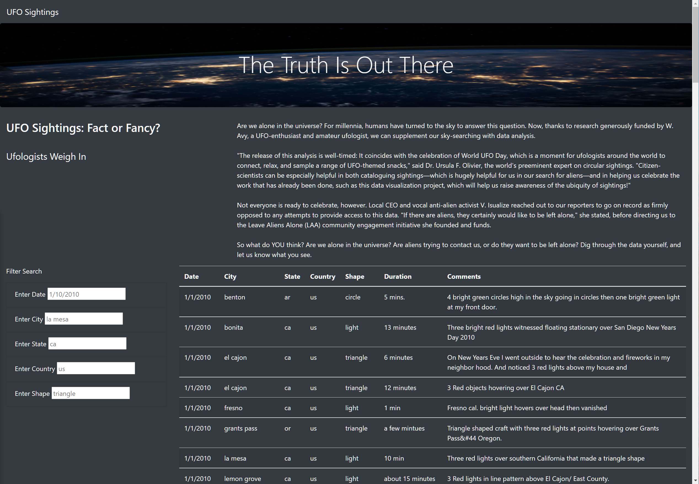

# UFOs

## Overview: 
The project is to organize the UFO data to create dynamic webpage allow viewer to filter the UFO sightings baesd on user selection
 
 ## Result:

 Web page created using JavaScript, HTML, Bootstrap and CSS 
  

Fiters created to allow user to search the specific date, city, state, country and UFO Shapes

  

## Summary:
the data provided has only 2010 data and limited to North America. It will be more interesting find more data set for over a large period of time and cover more globle arears to see the UFO activities. 

Further analysis can be done is to provide a summary of the UFO sighting based on the user selection. 